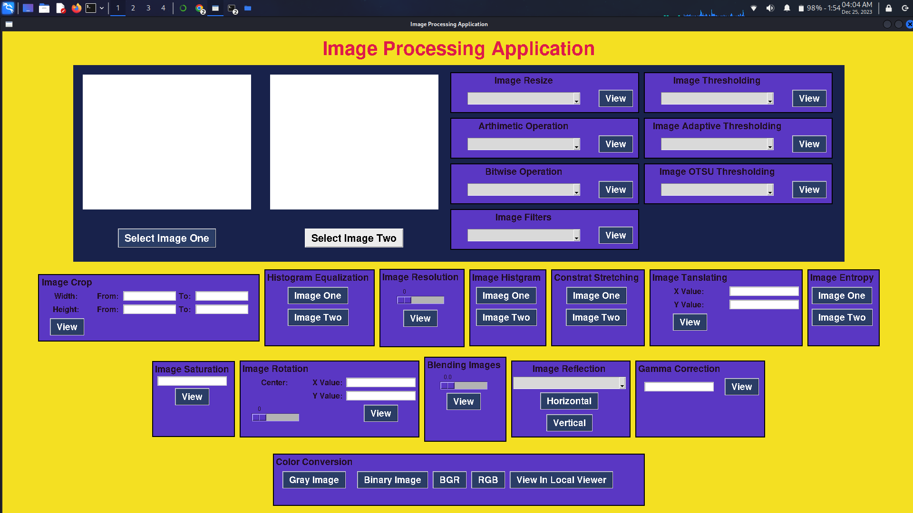
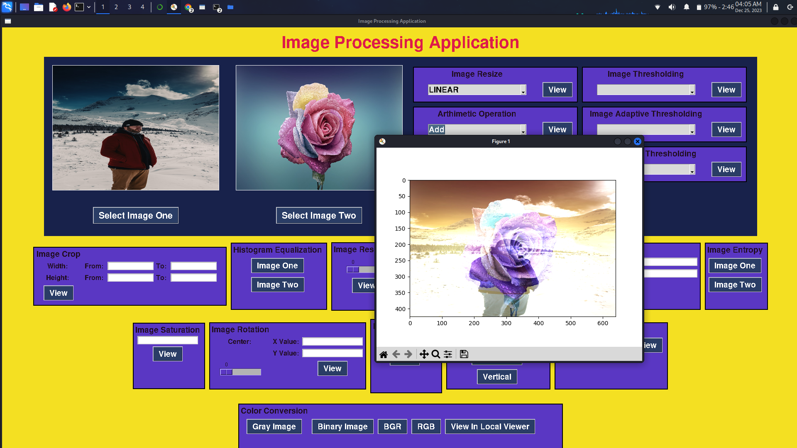
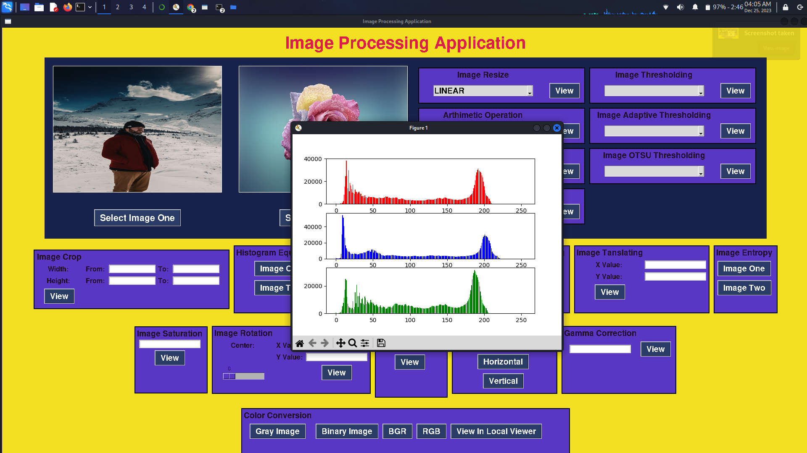

# Python Image Processing GUI using Tkinter

This Python application provides a Graphical User Interface (GUI) for performing various image processing operations. It utilizes the Tkinter library for creating the GUI elements, along with `PIL` (Python Imaging Library), `cv2` (OpenCV), `matplotlib`, and `numpy` for image manipulation and additional functionalities.

__________________________________________________________________________________________________

## Features

- **Load Images**: Allows users to load two images from their local storage.
- **Image Display**: Displays the loaded images in the GUI window.
- **Image Processing Operations**: Provides a set of image processing operations like:
  - Color Conversion
  - Logical Operations
  - Arithimetic Operations
  - Thresholding (OTSU, Adaptive)
  - Image Crop
  - Histograms
  - Image Resolution
  - Constrat Stretching
  - Resize
  - Rotate
  - Filters.
  - Gamma Correction
  - and more!

## File Structure

- `main.py`: The main Python script containing the GUI implementation.
- `README.md`: This file providing instructions and information about the application.

## GUI

## Contributing

Contributions are welcome! If you want to add new features, fix bugs, or improve the application, feel free to open a pull request or raise an issue.